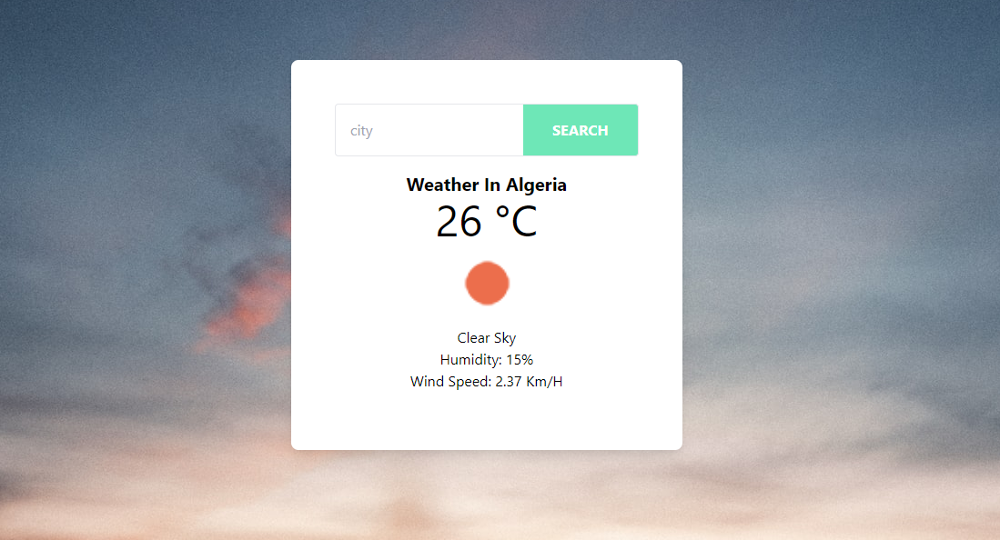

# js-weather-app
A simple weather  app built with javascript vanilla,User can find weather from anywhere around the world using city names.
 The goal of this project was work with API's .
## Screenshots



## Built With 🔨
- Javascript
- Html
- Webpack


## Live Demo 🚀
[Weather app](https://rahalrazika.github.io/js-weather-app/)

## Getting Started 💻

## Installation

To get a local copy of the repository please run the following commands on your terminal:

```
$ cd <folder>
```

```
$ git clone git@github.com:rahalrazika/js-weather-app.git
```


## Author

👤 **Razika Rahal**

- Github: [@rahalrazika](https://github.com/rahalrazika)
- Linkedin : [Razika Rahal](https://www.linkedin.com/in/razika-rahal-85539bbb/)
- Twitter: [@Razika Rahal](https://twitter.com/RahalRazika)


## 🤝 Contributing

Contributions, issues and feature requests are welcome!

## Show your support

Give a ⭐️ if you like this project!

## Acknowledgments

-  Odin projects
-  Microverse
